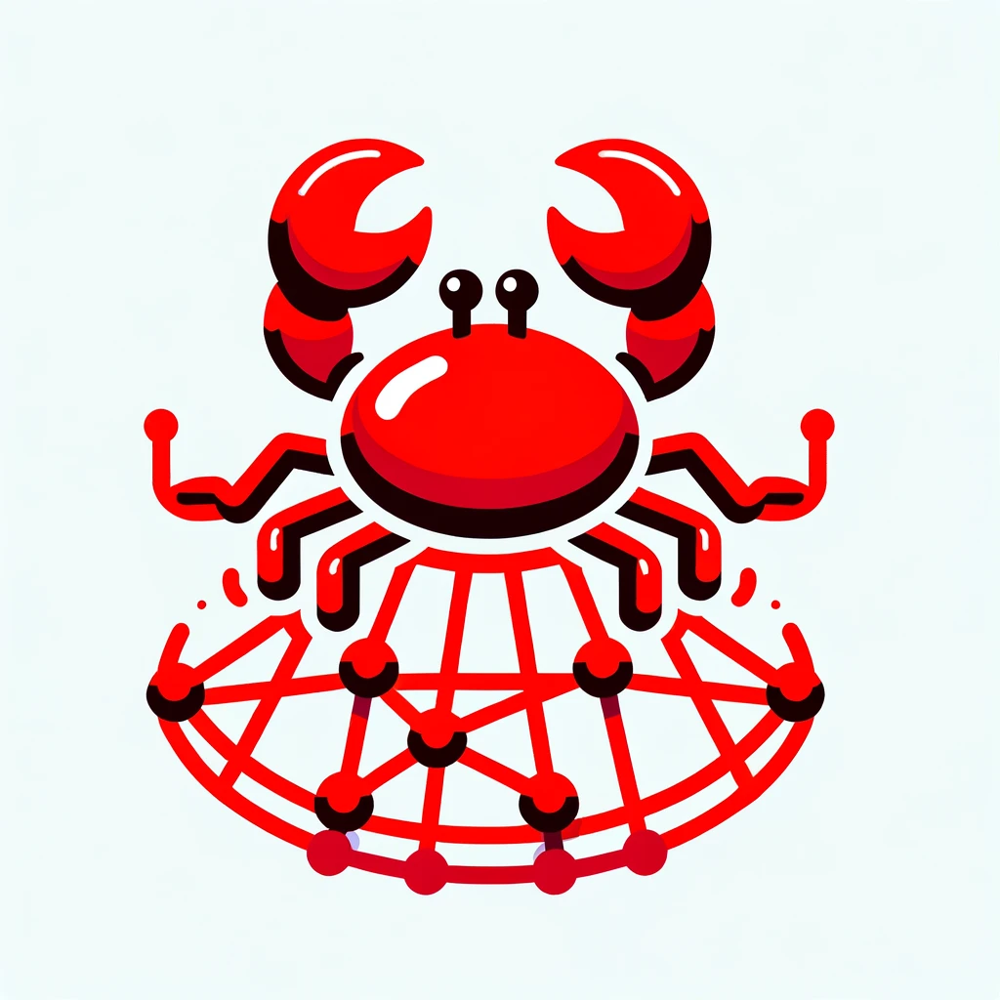

# Pluggable Transports in Rust (PTRS)

  <a href="https://github.com/jmwample/ptrs/actions/workflows/rust.yml">
    
  
  
  

This repository contains multiple related crates implementing the lyrebird (obfs4) library,
lyrebird binary, and Pluggable Transports in Rust (PTRS) library.

|                 Crate                    |   Description  | Crates.io | Docs | MSRV |
-------------------------------------------|----------------|-----------|------|------|
| [`ptrs`](./crates/ptrs) | A library supporting implementation and integration of Pluggable Transport protocols. |  |  | 1.70 |
| [`lyrebird`](./crates/lyrebird) | Implementation of the `Lyrebird` Tor bridge and a forward proxy compatible with `ptrs`. |  |  | 1.77 |
| [`obfs4`](./crates/obfs4) | An implementation of obfs4 pluggable transport library in pure rust. |  |  | 1.77 |
| [`o5`](./crates/o5) | An implementation of o5 pluggable transport library in pure rust. |  |  | 1.77 |

## MSRV

The Minimum Supported Rust Versions (MSRV) for the various crates are listed above.
These are ensured by test and build steps in the CI pipeline.

Once these crates reach a semi-stable state any changes to MSRV will be accompanied
with a minor version bump. We will not increase MSRV on PATCH releases, though downstream
dependencies might.

Along these lines, we won't increase MSRV just because we can: we'll only do so when we have a
reason. (We don't guarantee that you'll agree with our reasoning; only that
it will exist.)

## Related

Things to keep an eye on:

- [X] [`kemeleon`](https://github.com/jmwample/kemeleon) crate implementing the [Kemeleon ML-KEM Key obfuscation algorithm(s)](https://eprint.iacr.org/2024/1086.pdf).
- [ ] PR implementating elligator2 for the `dalek` ed25519 library. [PR Here](https://github.com/dalek-cryptography/curve25519-dalek/pull/612)

## Open Source License

Dual licensing under both MIT and Apache-2.0 is the currently accepted standard by the Rust language
community and has been used for both the compiler and many public libraries since (see
[Why dual MIT/ASL2license?](https://doc.rust-lang.org/1.6.0/complement-project-faq.html#why-dual-mitasl2-license)).
In order to match the community standards, ptrs is using the dual MIT+Apache-2.0 license.

## Contributing

Contributions, Issues, and Pull Requests are welcome!

## Potential logos?

These logos were generated using DALLE-3

